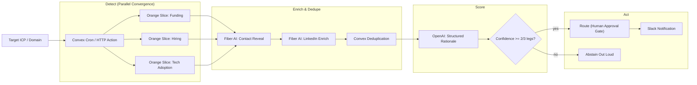
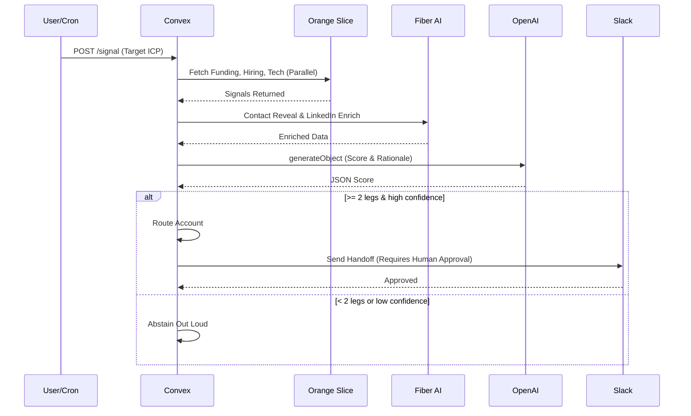

# BEACHHEAD

_The real-time GTM war room that finds your in-market accounts — and tells you when it's NOT sure._

**POWERED BY OUR SPONSORS**

---

**BEACHHEAD** finds the companies standing up a new go-to-market motion in real time — pulling live funding, hiring, and tech-adoption signals, converging them on a single account, scoring fit, and routing one qualified human handoff. Its defining feature: when the evidence isn't there, it **abstains out loud** instead of guessing.

## The Problem

RevOps and GTM engineers find out a company is standing up a new GTM motion — fresh funding, a burst of category-team hiring, a newly-adopted adjacent tool — weeks after it happens, when the window to win the account is already closing. The "intent data" sold to fix this is noisy and heavily false-positive.

*   **You cannot trust a score without abstention.** Every GTM tool we'd used was confidently wrong — it always returned a row, always had a "92% fit," and never once said "I don't know." That false confidence is what makes operators stop trusting their own pipeline.
*   **The last-mile play is dead.** Cold email yields a ~1% reply rate. If you don't have high-conviction context, you are just adding to the noise.
*   **The hard part is the grading.** Detecting one more signal is easy. Knowing which account is _really_ in-market right now, why, and honestly admitting when the evidence isn't there is the asymmetry.

## The Solution

Beachhead is an **intent engine wrapped around a verifier you can trust**, working in real time across four stages: **DETECT → ENRICH → SCORE → ACT**.

1.  **Point and run.** You point Beachhead at an ICP or a domain. A Convex cron and a public `POST /signal` HTTP action feed one entry point that opens a run.
2.  **Parallel detection.** Three convergence legs run in parallel against live provider APIs:
    *   **Funding:** Orange Slice (Crunchbase) recent-raise signal.
    *   **Hiring:** Orange Slice (PredictLeads) category-team job-opening burst.
    *   **Tech adoption:** Orange Slice (BuiltWith) newly-detected tooling.
3.  **Enrich and dedupe.** It enriches the account with Fiber AI (live contact reveal / LinkedIn enrichment) and dedupes it to ensure we don't spam the same account.
4.  **Honest scoring.** It scores it with a pure, unit-tested `decide()` function. It routes only when ≥2 legs fire with enough confidence. Otherwise, it **abstains out loud** ("only 1 of 3 legs — not routing").
5.  **Auditable action.** Routed accounts arrive with clickable per-source lineage (which leg fired, how strong, when) and a Slack handoff that **waits behind a human-approval gate** (nothing auto-sends).

The whole flow animates live on a reactive lead board and a 3D agent swarm with zero WebSocket code.

## Demo

**Watch the demo:** ‹record the live run per horizon/docs/demo-runbook.md›

**Live app:** ‹your live-keyed deployment URL›

### What the demo shows

| Surface | Link | What judges should look for |
| --- | --- | --- |
| **Live Dashboard** | [Production deployment](‹your live-keyed deployment URL›) | Enter an ICP. Watch accounts populate with live scores. Verify that weak signals receive an "ABSTAIN" card and strong signals (≥2/3 legs) are pushed to the human-approval routing queue. |
| **Demo Video** | [YouTube / Loom](‹record the live run per horizon/docs/demo-runbook.md›) | End-to-end visual walkthrough showing the Slack handoff gate and the reactive 3D swarm updates. |

## How It Works

### Integration Flow

## Key Features

*   **Real-time convergence detection** — Funding × hiring × tech-adoption, time-correlated on one account, pulled live. Each leg is cheap; the live join is the asymmetry.
*   **Honest, first-class abstention (the hero)** — Fewer than 2 legs or low confidence → a distinct "ABSTAIN" card, not a misleading low score.
*   **Per-source lineage on every account** — Which legs fired, each one's contribution, the rationale, and a full per-run trace timeline.
*   **Human-approval gate — no auto-send** — Verified by an integration test.
*   **Realtime reactive board + 3D swarm** — Convex reactive queries drive both surfaces.
*   **Provider-agnostic per-leg router** — Re-route a leg (Orange Slice ↔ Fiber) by editing one map; live contact reveal / live-LinkedIn via Fiber AI.
*   **Cache-first credit protection** — Repeat provider calls never re-charge the API.
*   **Deterministic, unit-tested scoring** — The routing/abstention contract is locked by tests.

## Sponsors & How We Use Them

| Sponsor | Shield | How Beachhead Uses It |
| --- | --- | --- |
| **Convex** |  | **The load-bearing spine.** Remove it and there is no detector, orchestration, or live board. The detector is a cron; the live trigger is an HTTP action; every external call is a Convex action writing back through internal mutations; the pipeline is sequenced by the scheduler; a cache-first layer lives in an `apiCache` table; the UI is driven by reactive queries so the board updates the instant a signal lands. |
| **Orange Slice** |  | **The signal pulse.** We use their APIs for live funding (Crunchbase), hiring (PredictLeads), and tech adoption (BuiltWith) signals to orchestrate convergence. |
| **Fiber AI** |  | **The enricher.** Provides live contact reveal and live-LinkedIn enrichment for the final mile. |
| **OpenAI** |  | **The evaluator.** We use `generateObject` for structured scoring and to write the rationale for why an account routed or abstained. |

## Verification & Trust

Every GTM tool we'd used was confidently wrong — it always returned a row, always had a "92% fit," and never once said "I don't know." We built the opposite. 

| Condition | Result | Action |
| --- | --- | --- |
| **< 2/3 legs** or weak signal | **"Abstain out loud"** | Displayed as a distinct "ABSTAIN" card; not force-ranked or pushed. |
| **≥ 2/3 legs** + high confidence | **Route account** | Sent to Slack handoff behind a strict human-approval gate. |

### Verified technicals
*   `tsc --noEmit` clean · `eslint` 0 errors / 0 warnings · `next build` green.
*   **14/14 tests** (`vitest`: pure-logic convergence/idempotency + `convex-test` integration of enrich→score→act, dedupe, and the approval gate).
*   Convex deploy: **17 indexes across 15 tables**.
*   **End-to-end signal contract:** a strong account routes; a weak account abstains.

## Repository Structure

| Path | Role |
| --- | --- |
| `horizon/convex/` | Backend logic: reactive queries, crons, HTTP actions, internal mutations, and provider integrations. |
| `horizon/app/` | Next.js 16 frontend, Tailwind v4 styling, and the React Three Fiber 3D agent swarm. |
| `docs/research/` | Deep dossiers on the AI-GTM landscape, sponsor capabilities, and judge profiles. |
| `docs/debate/` | Our team's architectural debate and final objective synthesis that led to BEACHHEAD. |
| `README.md` | This file. |
