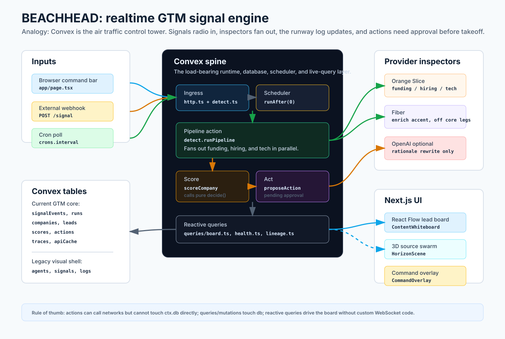
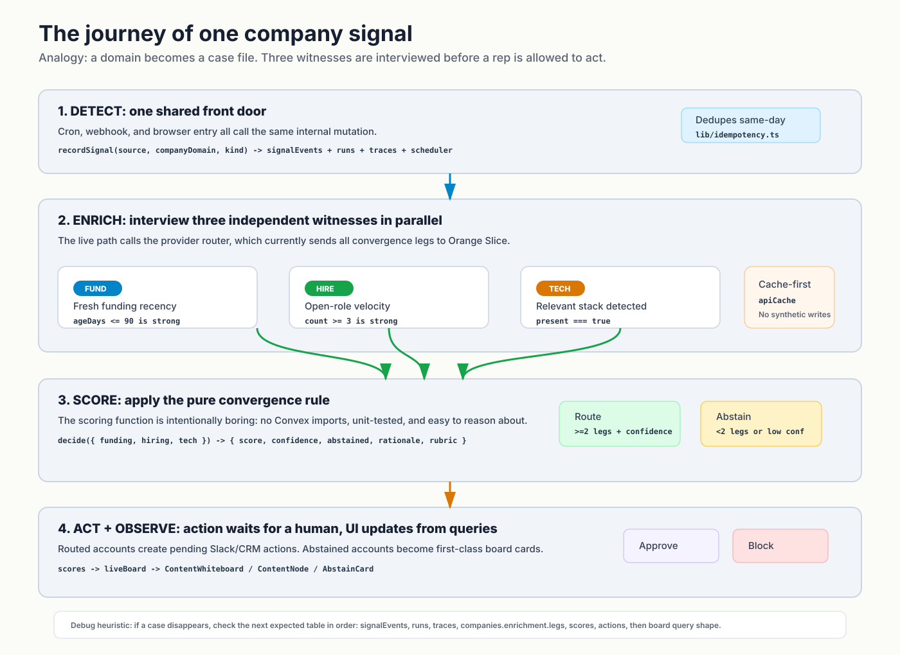
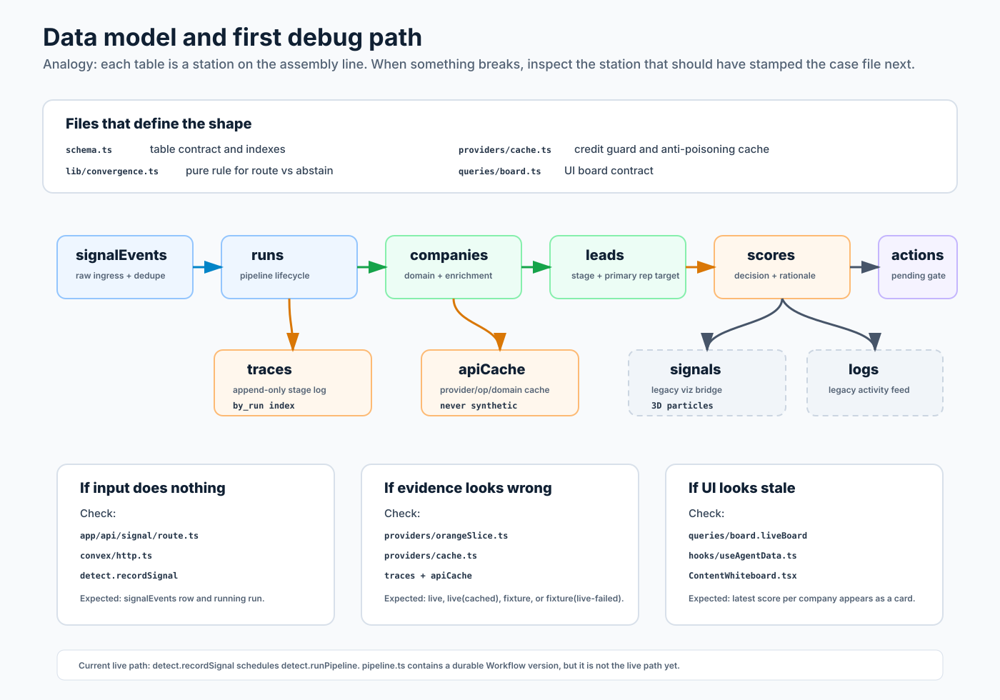

# BEACHHEAD Visual Primer

This primer teaches the current `horizon/` app to a new engineer through three visual maps. The short version: BEACHHEAD is a realtime GTM signal engine. A company/domain enters the system, Convex fans out provider checks, a pure scoring rule decides whether the evidence is strong enough, and the UI updates from Convex reactive queries.

Open `index.html` to review all three graphics together. The canonical graphics are SVGs; full-canvas PNG exports also live under `png/` for tools that do not render SVG cleanly.

## 1. System Map

Mental model: Convex is the air traffic control tower. The Next.js UI and external webhook both radio in a company signal. Convex dispatches provider inspectors, records every runway event in tables, and broadcasts board updates back to the UI. Providers are outside the tower; they never write directly to the database.

Key files:
- `horizon/app/page.tsx` wires the UI shell, command overlay, board, and 3D flourish.
- `horizon/app/api/signal/route.ts` proxies browser submissions to Convex HTTP `/signal`.
- `horizon/convex/http.ts`, `horizon/convex/crons.ts`, and `horizon/convex/detect.ts` share the ingest path.
- `horizon/convex/providers/*` owns live/fixture provider calls and caching.
- `horizon/convex/queries/board.ts` shapes the live board consumed by React Flow.

## 2. Signal Journey

Mental model: a domain is a case file. Three witnesses are interviewed in parallel:

- Funding: recent raise or funding recency.
- Hiring: open roles or hiring velocity.
- Tech: detected stack or adjacent-tool signal.

The scorer does not route on vibes. It needs at least two witnesses and enough confidence. If not, the system creates an explicit `ABSTAIN` outcome instead of pretending the lead is hot.

Example from fixture mode:
- `stripe.com` has 3/3 synthetic legs and routes.
- `acme.com` falls back to one weak hiring leg and abstains.

## 3. Data And Debug Map

Mental model: debug by asking, "which table should have changed next?"

- Ingest: `signalEvents` and `runs`.
- Provider evidence: `traces`, `apiCache`, and `companies.enrichment.legs`.
- Decision: `scores` and `leads.stage`.
- Action: `actions`.
- Visualization bridge: legacy `signals` and `logs` still light the 3D scene.

Important current-state notes:
- The live path is a scheduled Convex action from `detect.recordSignal` to `detect.runPipeline`.
- `horizon/convex/pipeline.ts` defines a durable Workflow version, but the README and code comments mark it as a deferred/stretch path, not the current live path.
- Orange Slice runs in Convex Node runtime via `"use node"` in `horizon/convex/providers/orangeSlice.ts`.
- Synthetic fixtures are labeled with `__synthetic: true` and should never be stored in `apiCache`.
- The app contains older Horizon swarm tables alongside the newer BEACHHEAD GTM tables. Treat the swarm tables as visualization shell unless a feature explicitly uses them.

## First Debug Pass For New Engineers

1. Start at `horizon/README.md` for the product thesis and honesty boundary.
2. Read `horizon/convex/schema.ts` to understand table names.
3. Trace `recordSignal -> runPipeline -> scoreCompany -> proposeAction`.
4. Read `horizon/convex/lib/convergence.ts` before changing scoring.
5. For live/fixture questions, inspect `horizon/convex/providers/orangeSlice.ts`, `horizon/convex/providers/cache.ts`, and recent `traces`.
6. For UI questions, inspect `horizon/app/page.tsx`, `horizon/app/hooks/useAgentData.ts`, and `horizon/app/components/ContentWhiteboard.tsx`.
